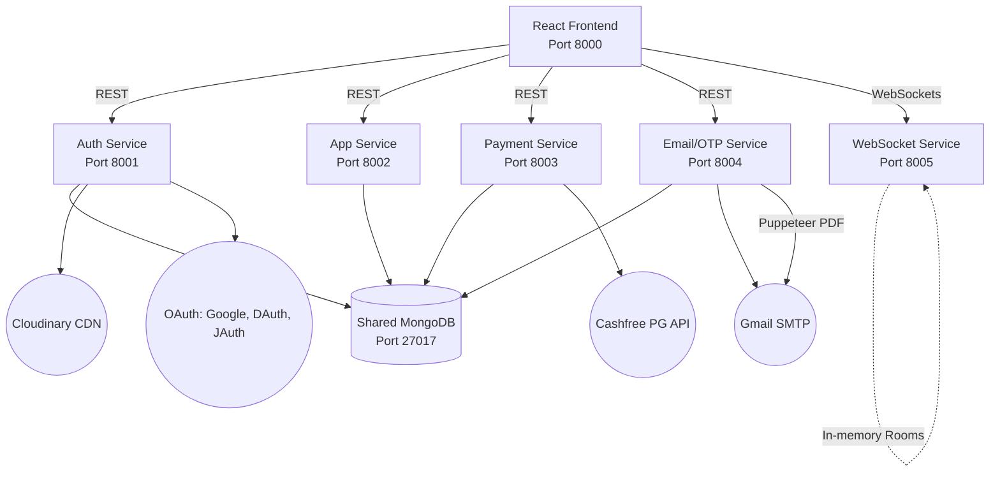
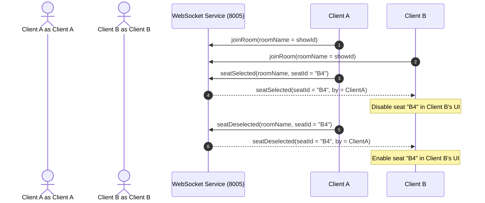
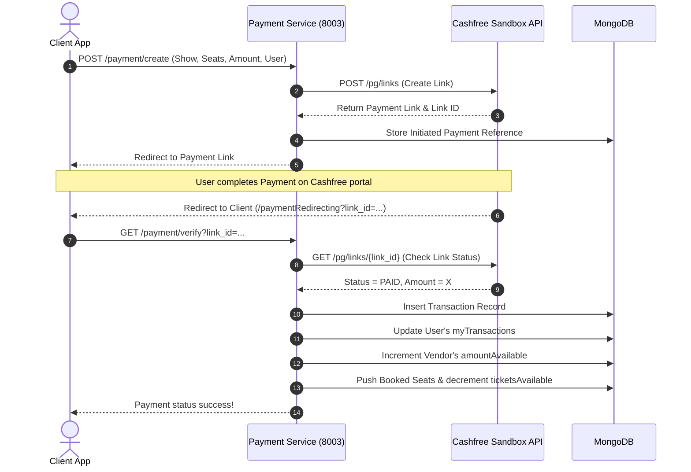
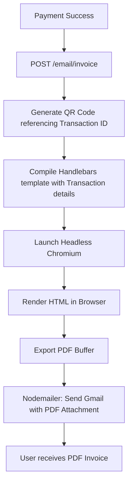

# High-Level Design (HLD) - NittBooking

This document provides a comprehensive High-Level Design (HLD) for **NittBooking**, a microservices-based booking platform for movies and concerts. The application is built with a decoupled architecture, using React on the frontend and Node.js/Express on the backend, with MongoDB serving as the centralized persistent storage.

---

## 1. System Architecture Overview

NittBooking uses a **microservices architecture** where services are separated by domain concerns. All microservices communicate with a shared MongoDB instance. The frontend interacts directly with individual services using CORS and environment configuration.

---

## 2. Service Description & Port Directory

| Container/Service Name | Port | Primary Tech Stack | Core Responsibilities |
| :--- | :--- | :--- | :--- |
| **`nittbooking-client`** | `8000` | React 19, Vite, Tailwind CSS v4, Socket.io-client | Client UI, role-based pages, seat reservation dashboard, transaction tracking. |
| **`nittbooking-auth`** | `8001` | Node.js, Express, JWT, Multer, bcryptjs | User signups, password resets, profile edits, image uploads via Cloudinary, external OAuth. |
| **`nittbooking-app`** | `8002` | Node.js, Express, Mongoose | Content management (movies, concerts, theaters, stadiums), show lists, date/time slots. |
| **`nittbooking-payment`** | `8003` | Node.js, Express, Cashfree PG, Axios | Cashfree Sandbox integration, payment link creation, webhook/return URL verifications, transaction records. |
| **`nittbooking-email`** | `8004` | Node.js, Express, Puppeteer, Handlebars, Nodemailer | PDF receipt generation (with QR codes), verification OTP generation, invoice and verification emails. |
| **`nittbooking-websocket`**| `8005` | Node.js, Express, Socket.io | Real-time seat allocation, locking/unlocking seats per room (show times/slots). |
| **`nittbooking-mongodb`** | `27017`| MongoDB 7.0 | Centralized storage for user profiles, shows, bookings, and transactions. |

---

## 3. Core Database Schemas (MongoDB)

All services connect to `mongodb://mongodb:27017/NittBooking`. Schema definitions are shared implicitly across services:

### 3.1. Users (`users` collection)
Holds profile information, account status, and transaction references for all three roles (`client`, `vendor`, `admin`).
* `role`: String (enum: `['client', 'vendor', 'admin']`)
* `username`: String
* `email`: String (Unique)
* `password`: String (Hashed via bcrypt)
* `isVerified`: Boolean
* `profileImageUrl`: String
* `amountAvailable`: Number (Used primarily for vendor earnings)
* `myTransactions`: Array of ObjectId (refs `transactions`)

### 3.2. Shows (`mshows` and `cshows` collections)
Represents scheduling information for Movies and Concerts respectively.
* **Movie Shows (`mshows`):**
  * `movie`: ObjectId (ref `movies`)
  * `theater`: ObjectId (ref `theaters`)
  * `date`: String
  * `slot`: String
  * `basePrice`: Number
  * `ticketsAvailable`: Number
  * `ticketsBooked`: Array of Objects:
    * `transactionId`: ObjectId (ref `transactions`)
    * `seatsBooked`: Array of Strings (e.g. `['A1', 'A2']`)
    * `BookedBy`: ObjectId (ref `users`)
* **Concert Shows (`cshows`):**
  * Same structure as above, referencing `concerts` and `stadiums` instead.

### 3.3. Transactions (`transactions` collection)
Stores billing and purchase logs.
* `user`: ObjectId (ref `users`)
* `vendor`: ObjectId (ref `users`)
* `link_id`: String (Cashfree reference)
* `amount`: Number
* `purpose`: String (enum: `['movie', 'concert']`)
* `status`: String (enum: `['PAID', 'FAILED']`)
* `metaData`: Object
  * `showId`: ObjectId (ref `mshows`/`cshows`)
  * `seatsBooked`: Array of Strings
* `createdAt`: Date

---

## 4. Key Workflows & Data Flows

### 4.1. Real-Time Seat Selection Flow
To prevent double bookings, the client uses WebSockets to lock seats temporarily.

### 4.2. Booking and Payment Verification Flow
Tickets are booked through a Cashfree payment link. The show document and user/vendor wallets are updated on verification.

### 4.3. PDF Invoice Generation & Dispatch Flow
Triggered asynchronously once the payment is verified, sending an invoice receipt directly to the user's email.

---

## 5. Client Application & Routes Map

The frontend is structured into three clear user roles, handled via `protectedRoute.jsx` and `publicRoute.jsx`:

### 5.1. Client Paths (End User)
* `/`: Public landing page (`home.jsx`) - Browsing movies & concerts.
* `/:entityType/:_id`: Entity Info (`entityInfo.jsx`) - View details for selected movie/concert.
* `/:entityType/:_id/:type`: Ticket Selection (`ticketSelection.jsx`) - Pick count and pricing category.
* `/:entityType/:_id/:type/:showId`: Seat Selection (`seatSelection.jsx`) - Real-time seat layouts via WebSockets.
* `/myBookings`: Bookings dashboard (`mybookings.jsx`) - View purchased tickets, download invoice PDFs.
* `/recentTransactions`: Wallet transactions log (`recentTransactions.jsx`).

### 5.2. Vendor Paths
* `/vendor/dashboard`: High-level metrics showing earnings (`amountAvailable`) and show performance graphs.
* `/vendor/home`: CRUD operations for shows, movies, and concerts owned by the vendor.
* `/vendor/shows/:entityType/:entityId`: Manage show scheduling times and base ticket pricing.
* `/vendor/transactions`: Log of all tickets sold for vendor-owned events.

### 5.3. Admin Paths
* `/admin/dashboard`: Global usage indicators, aggregate sales charts, system-wide metrics.
* `/admin/users`: User management panel (promote, verify, or block accounts).
* `/admin/movies` & `/admin/concerts`: Global catalog management.
* `/admin/events/:vendorId`: Vendor approval queue for new event creations.
* `/admin/transactions`: System-wide audit log for all payment events.

---

## 6. Technology Decisions & Constraints

1. **Shared Database Access**: The microservices interact directly with the same database. This accelerates development but requires strict coordination on shared schema modifications (e.g. `users`, `transactions`, `mshows`).
2. **Ephemeral Payment Links**: Payment link references (`paymentreferences` collection) have a MongoDB TTL index set to expire in 5 minutes (`expires: 300`), keeping the active verification pool lean.
3. **Headless PDF Generation**: Puppeteer is deployed inside the `email-service` container. In Linux containers, this requires `--no-sandbox` arguments and Chromium runtime packages, configured via `PUPPETEER_EXECUTABLE_PATH`.
4. **WebSocket Rooms**: WebSocket connections join a Socket.io room named after the specific `showId`. Seat locks are in-memory on the Socket.io server and broadcasted immediately; they are not persisted to the database until payment is initiated.
