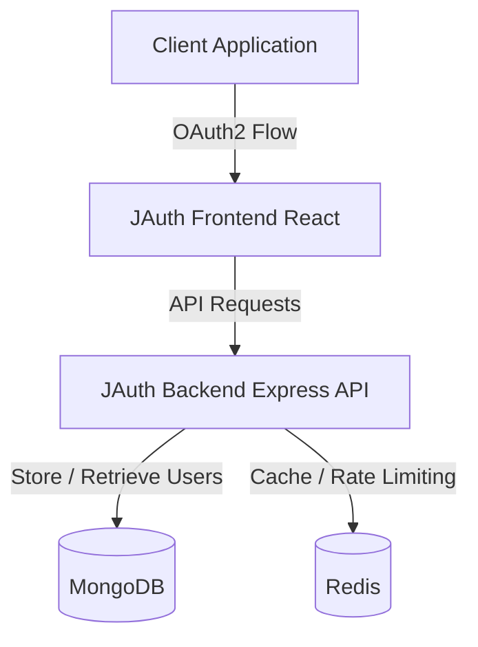

# High-Level Design (HLD) - JAuth

## 1. Overview
JAuth is a modern OAuth2 authentication service designed to manage user identities, facilitate secure authentication flows, and issue JSON Web Tokens (JWT). It provides both an intuitive React frontend for user interaction (login/registration) and an Express-based API for handling backend logic, data persistence (MongoDB), and caching (Redis).

## 2. Architecture & Tech Stack
The JAuth architecture follows a typical client-server model wrapped in Docker containers for easy deployment.

- **Frontend:** React, Vite, Axios
- **Backend API:** Node.js, Express.js
- **Database:** MongoDB (User data persistence)
- **Cache / Rate Limiting:** Redis
- **Authentication:** OAuth2 Authorization Code Flow, JWT (Access & Refresh tokens), bcrypt
- **Deployment:** Docker, Docker Compose, Nginx (Frontend proxy)

## 3. High-Level Component Diagram

## 4. Components Description

### 4.1 Frontend (Client)
- A React Single Page Application (SPA) that provides the user interface for Login, Registration, and OAuth authorization prompts.
- Served through an Nginx proxy in production to handle static file routing securely.

### 4.2 Backend (Server)
- **Controllers:** Handles the business logic for standard user authentication (Register, Login, Logout) and OAuth2 specific flows (Authorize, Exchange Code, Get User).
- **Middleware:** Performs JWT verification, rate limiting (via Redis), and CORS handling.
- **Models:** Defines the Mongoose schemas for User data storage.

### 4.3 Database Layer (MongoDB)
- Persists user accounts, profiles, and hashed passwords.

### 4.4 Cache Layer (Redis)
- Used for API rate limiting to prevent brute-force attacks.
- Used to cache session or temporary OAuth authorization codes during the token exchange flow.

## 5. OAuth2 Authentication Flow
JAuth implements the **Authorization Code Flow**.

1. **Authorization Request:** The third-party Client Application redirects the user to `JAuth Frontend` (`/oauth/authorize`).
2. **User Consent:** The user logs in to JAuth and approves the requested scopes.
3. **Authorization Code:** JAuth redirects the user back to the Client Application with an Authorization Code (`/oauth/getCode`).
4. **Token Exchange:** The Client Application's backend server sends the Authorization Code to JAuth Backend (`/oauth/getToken`) to securely exchange it for an Access Token and a Refresh Token.
5. **Resource Access:** The Client Application uses the Access Token to request the user's profile (`/oauth/getUser`).

## 6. Security Posture
- **JWT Protection:** Short-lived access tokens and longer-lived refresh tokens.
- **Cookie Security:** HttpOnly cookies for secure token storage to mitigate XSS attacks.
- **Rate Limiting:** Protects `/login` and `/register` endpoints from brute-force attempts.
- **Password Protection:** bcrypt hashing for passwords at rest.

## 7. Infrastructure Setup
The `docker-compose.yml` orchestrates four primary services:
1. `mongodb` (Port 27017)
2. `redis` (Port 6379)
3. `server` (Port 5001)
4. `client` (Port 80 via Nginx proxy)
